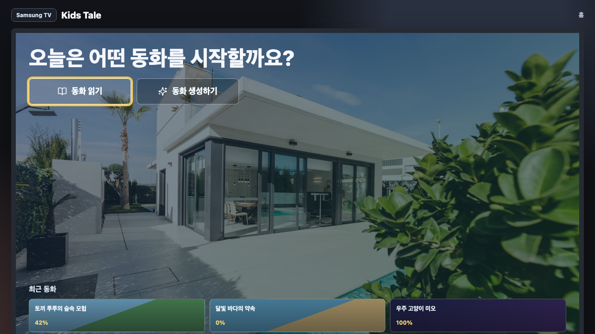

# Samsung TV Story App

Samsung TV 스타일의 동화 생성/재생 React 웹앱입니다.

## 실행 방법

### 1) 의존성 설치
```bash
npm install
```

### 2) 개발 서버 실행
```bash
npm run dev
```

실행 후 터미널에 표시되는 로컬 주소로 접속하세요.  
기본은 `http://127.0.0.1:5173`이며, 포트가 사용 중이면 다른 포트(예: `5174`)로 자동 변경됩니다.

### 3) 프로덕션 빌드
```bash
npm run build
```

### 4) 빌드 결과 미리보기
```bash
npm run preview
```

## 랜딩 페이지 이미지


